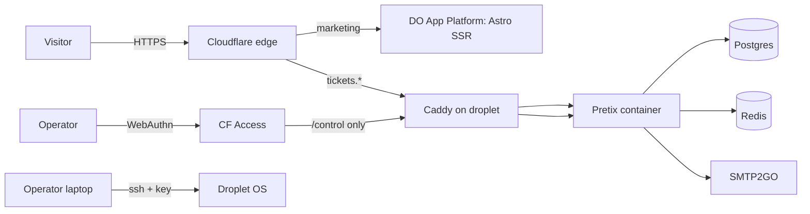

# Threat Model — antiphazeprod

Two distinct workloads under one repo:
1. **Marketing site** — Astro SSR, deployed to DigitalOcean App Platform.
2. **Tickets stack** — Pretix (Django + Postgres + Redis + Caddy reverse proxy) on a DigitalOcean droplet.

These are different threat surfaces and the threat model treats them separately.

## Asset inventory

| Asset | Sensitivity | Notes |
|---|---|---|
| Marketing pages, blog | Public | Astro SSR on App Platform |
| Contact form data in flight | PII (name, email, event date, location) | Posted to `website/src/pages/api/contact.ts` |
| Ticket purchase data | PII + transactional (name, email, event, ticket type, payment status) | Stored in Pretix Postgres on droplet |
| Pretix admin credentials | **High** | WebAuthn/TOTP only via CF Access on `/control` |
| `SQUARE_ACCESS_TOKEN` (if Pretix-Square plugin used) | High | SOPS-encrypted in `prod.env.enc`; injected at container start |
| SMTP2GO credentials | Medium | SOPS-encrypted; quarterly rotation |
| SOPS age key | **Critical** | On droplet at `/etc/age/keys.txt`, mode 0400 root-only; never in git; recovery copy in offline backup |
| SSH deploy key | High | Per-droplet, ed25519, no passphrase needed (key file itself is the secret); rotated per `docs/runbooks/secrets-rotation.md` |
| Postgres / Redis | Internal-only | Bound to docker-compose internal network; **must not** publish ports (Conftest-enforced) |
| Cloudflare API token | Medium | GitHub Encrypted Secrets, scoped to `Workers Scripts:Edit` and `Pages:Edit` only |
| DigitalOcean API token | Medium | GitHub Encrypted Secrets; scoped to App Platform only |

## Trust boundaries

```
[Browser] --> [Cloudflare edge (WAF + DDoS + Turnstile)] --HTTPS--> [DO App Platform: Astro SSR]   (marketing)
[Browser] --> [Cloudflare edge] --HTTPS--> [DO droplet: Caddy] --HTTP--> [Pretix container]        (tickets)
[Browser] --> [Cloudflare Access (WebAuthn)] --HTTPS--> [Caddy] --> [Pretix /control]              (admin)
                                                          |
                                                          +--> [Postgres internal]
                                                          +--> [Redis internal]
                                                          +--> [SMTP2GO]
```

The droplet's external attack surface is **only** Caddy, on TCP/80 (redirects to 443) and TCP/443. SSH (TCP/22) is restricted to the operator's IP via `ufw` and key-only auth. Postgres and Redis are docker-compose internal networks, never exposed to the host or the internet (Conftest policy enforces "no published ports except for caddy").

## Data flow



## STRIDE-lite per asset

| Asset | Threat | Mitigation |
|---|---|---|
| Marketing site | **T**ampering at edge | Cloudflare proxy + DO TLS |
| Marketing site | **D**oS | Cloudflare DDoS protection; App Platform autoscale |
| Contact form | **S**poofing/spam | Turnstile required; rate-limit middleware in `website/src/pages/api/contact.ts`; honeypot field |
| Pretix `/control` | **C**redential stuffing | Cloudflare Access in front of `/control` with WebAuthn — no password login is ever exposed to the public internet |
| Pretix DB | **I**nformation disclosure (PII dump) | Postgres internal-only (Conftest); SOPS for runtime credentials; daily encrypted backup off-droplet |
| SMTP creds | **R**epudiation / abuse | Server-side only; never in client code; rate-limited at SMTP2GO |
| age key | **E**levation of privilege (decrypts everything) | Mode 0400 root; offline recovery copy; never in git, never in CI |
| SSH | **E**levation | Key-only auth; root login disabled; `fail2ban` enabled; ufw default-deny; key rotation in runbook |
| Caddy headers | **T**ampering / weakening | Caddyfile in git; CI smoke-test verifies expected headers; Conftest does not weaken policy |

## Mitigations (concrete)

- **CF Access on `/control`** — only specified emails (with WebAuthn) can reach the admin URL. Direct droplet access from outside the operator's IP is blocked at Cloudflare; even with the URL, no credentials reach Pretix without WebAuthn proof.
- **Postgres / Redis internal-only** — Conftest policy `containers.rego` denies any service publishing host ports except `caddy`. Verified on every PR by the `policy` CI job.
- **No privileged containers** — Conftest denies `privileged: true`; every service must declare `cap_drop: [ALL]`.
- **SOPS + age** — `infrastructure/docker/prod.env.enc` is the only env-var source; decrypted into the container at start. Re-encrypted (= committed) when secrets change. Plain `.env` files are gitignored.
- **Caddy security headers** — HSTS (preload), X-Content-Type-Options nosniff, Referrer-Policy strict-origin-when-cross-origin, Permissions-Policy minimal, CSP appropriate for Pretix UI. Verified by `tools/headers/check-tls.sh` smoke-test.
- **Auto-renew TLS** — Caddy handles ACME automatically.
- **fail2ban + ufw** — basic SSH hardening on the droplet.
- **CI gates**: secrets, sast, sca, iac, container (Trivy on the Caddy image), policy, build with SBOM.
- **Drift nightly** — runs the same scanners against `main` daily; new CVEs in pinned deps surface within 24h.

## Specific concerns

- **SMTP credential leakage** — historically rotated; future leaks would manifest as outbound abuse. Mitigation: SOPS-only, never inline; SMTP2GO usage caps as detective control.
- **Pretix plugin supply-chain** — Pretix is Django; plugins can be installed by the admin. Limit installed plugins; track upstream Pretix advisories; OSV-Scanner does not cover Python plugins, so the `update-pretix.yml` workflow + monthly review by operator are required.
- **Caddy header drift** — Caddy auto-reloads on config change; smoke test in `_drift-nightly.yml` catches accidental weakening.

## Incident response

- **DB breach suspected:** stop Pretix (`docker compose stop pretix`); preserve volumes for forensics; rotate Postgres password (SOPS); restore from last-good backup; rotate Pretix admin secrets (force re-issue WebAuthn).
- **CF Access bypass concern:** revoke CF Access policy; switch to droplet-firewall-only (operator IP) until investigation completes.
- **age-key leak:** treat as **everything is compromised** — rotate every secret in `prod.env.enc`, generate new age key, re-encrypt, redeploy.
- See `docs/runbooks/incident-response-template.md` for general flow.

## Open questions

- Move backup encryption from age (single-key) to age recipient list with 2-of-3 quorum? Deferred — single-operator scale.
- Add CrowdSec or similar in front of Caddy? Deferred — Cloudflare WAF is sufficient at current scale.
