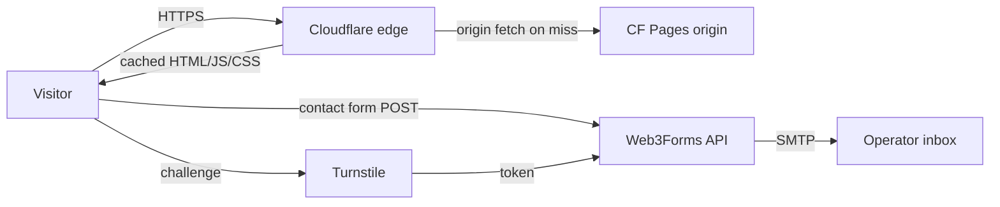

# Threat Model — GlobalManagement

Static Astro SPA, deployed to Cloudflare Pages, contact form processed by Web3Forms.

## Asset inventory

| Asset | Sensitivity | Notes |
|---|---|---|
| HTML / CSS / JS pages | Public | Marketing content; no auth, no PII at rest |
| Contact-form submissions in flight | PII (name, email, message) | Posted to Web3Forms; the form key is public-by-design |
| Web3Forms access key | Low (intentionally public) | Stored in client-side code; server-side verification by Web3Forms |
| Cloudflare Pages deploy token | Medium | In GitHub Encrypted Secrets; rotates quarterly |
| GitHub repo access | Medium | Branch protection on `main`; signed commits required |

## Trust boundaries

```
[Browser] --HTTPS--> [Cloudflare edge (WAF + DDoS + cache)] --HTTPS--> [Cloudflare Pages origin]
   |
   +-- form POST --> [Web3Forms API] --> [SMTP -> operator inbox]
   +-- challenge --> [Cloudflare Turnstile]
```

Trust drops at every arrow. The browser is hostile (XSS surface). Web3Forms is a dependency we trust to handle PII responsibly per their privacy policy. Cloudflare Pages is the static origin; nothing executes server-side that we control.

## Data flow



## STRIDE-lite per asset

| Asset | Threat | Mitigation |
|---|---|---|
| Pages content | **T**ampering at edge | Cloudflare Pages signs each deploy; Cloudflare Universal SSL terminates TLS |
| Pages content | **I**njection / XSS via stale dependency | Static-only build, no SSR; CSP `script-src 'self'` blocks inline; OSV-Scanner gate |
| Contact form | **S**poofing / spam | Turnstile required before POST; Web3Forms server-side rate-limit |
| Contact form | **R**epudiation | N/A — best-effort form, no audit log requirement |
| Form submissions | **I**nformation disclosure (PII) | TLS in transit; Web3Forms ToS handles at-rest |
| Pages | **D**oS | Cloudflare free-tier DDoS mitigation; static-only origin tolerates very high RPS |
| Repo / pages config | **E**levation of privilege | Branch protection + signed commits + required reviewers on `_headers`/CSP changes |

## Mitigations

- **CSP** in `_headers`: `default-src 'self'; script-src 'self' https://challenges.cloudflare.com; frame-src https://challenges.cloudflare.com; ...` — no `unsafe-inline`, no `unsafe-eval`. Verified by `tools/headers/expected-baseline.json`.
- **HSTS** with `includeSubDomains` and a 1-year max-age (preload candidate after 6-month soak).
- **Turnstile** widget on the contact form. Web3Forms verifies the token server-side.
- **No third-party analytics** by default — adding any new third-party `<script>` requires CSP update + SRI hash.
- **Lefthook** pre-commit gates: gitleaks (no secrets in form-handler URL or anywhere else), actionlint (workflow safety).
- **CI gates**: secrets, sast, sca, iac, policy, build (SBOM). No container scan (no Docker).

## Magecart-specific posture

GlobalManagement does not handle payment. Magecart concern is muted, but the same defenses (CSP allowlist, no inline scripts, SRI) apply by default to all third-party scripts so the threat does not migrate in if the site grows.

## Incident response

- Operator email leaks: rotate via password manager, notify Web3Forms support if abuse.
- Cloudflare account compromise: see meta-repo `docs/runbooks/incident-response-template.md`.
- Defaced page: revert to last good commit on `main`; CF Pages auto-redeploys.

## Open questions

- Should we move from Web3Forms to a self-hosted minimal handler on a CF Worker for tighter control? Deferred — Web3Forms is good enough at zero cost.
