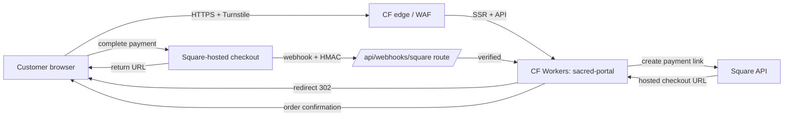

# Threat Model — sacred-portal-wellness

Next.js (App Router) on Cloudflare Workers (OpenNext adapter), with Square as the payment processor (Payment Link flow, hosted checkout pages — sacred-portal does **not** see card numbers, but does sit in the checkout journey).

## Asset inventory

| Asset | Sensitivity | Notes |
|---|---|---|
| Marketing pages, blog content | Public | Static + cached at the edge |
| Contact form submissions in flight | PII (name, email, message) | Posted to `/api/contact`; verified Turnstile required |
| Cart / checkout metadata | PII + transactional (item, price, customer email) | Stored briefly in Workers KV + sent to Square via the wrapper module |
| `SQUARE_ACCESS_TOKEN` | **High** — production money | Wrangler secret; never logged; only the `lib/square/index.ts` wrapper may import it (Semgrep-enforced) |
| Square webhook signing key | High | Wrangler secret; HMAC verified on every `/api/webhooks/square` POST (Semgrep-enforced) |
| Customer email addresses | PII | Square holds the source of truth; we keep only the order ID locally |
| Cloudflare Workers deploy token | Medium | GitHub Encrypted Secrets; quarterly rotation |

## Trust boundaries

```
[Browser] -- HTTPS --> [CF edge (WAF + Turnstile)] -- HTTPS --> [CF Workers (sacred-portal SSR)] -- HTTPS --> [Square API]
                                                                       |
                                                                       +-- HMAC-verified webhook <-- [Square]
[Browser] -- redirect --> [Square hosted checkout page] -- redirect back --> [Browser]
```

The trust boundary that matters most is the wrapper around Square: **only** `lib/square/index.ts` may import or read `SQUARE_ACCESS_TOKEN`, and **only** `app/api/webhooks/square/route.ts` may handle Square callbacks (with verified HMAC before any side effect).

## Data flow



## STRIDE-lite per asset

| Asset | Threat | Mitigation |
|---|---|---|
| Checkout page | **T**ampering with `<script>` (Magecart) | Strict CSP `script-src 'self' https://challenges.cloudflare.com`; SRI on every external script; no inline event handlers; Cloudflare WAF |
| `SQUARE_ACCESS_TOKEN` | **I**nformation disclosure / leak | Wrapper-only access (Semgrep custom rule blocks raw `process.env.SQUARE_ACCESS_TOKEN` use); never logged; Wrangler secret (encrypted at edge); rotated quarterly |
| Webhook endpoint | **S**poofing of "payment complete" by attacker | HMAC verification with constant-time compare **before** any side effect; rejection logged; Semgrep custom rule enforces presence of the verifier |
| Cart metadata | **T**ampering (price manipulation in browser before POST) | Server-side price re-derivation in `lib/square/index.ts`; never trust client-provided price |
| Contact / checkout form | **S**poofing (bot-driven cart spam) | Turnstile gate; rate limit per IP on `/api/checkout`; origin-header check |
| Customer PII | **I**nformation disclosure | Minimised — we keep only order ID + email locally (Workers KV) for receipts; full PII at Square |
| Workers runtime | **E**levation via dependency CVE | OSV-Scanner gate; nightly drift; signed releases (cosign) |
| Webhook delivery | **D**oS via replay | Square delivery is at-least-once; idempotency key on order processing |

## Mitigations (concrete)

- **`lib/square/index.ts` wrapper rule** — only this module may read `SQUARE_ACCESS_TOKEN`. Enforced by `tools/semgrep-custom/square-token-wrapper.yaml`. Violation blocks the SAST CI gate.
- **Webhook HMAC rule** — Semgrep custom rule `tools/semgrep-custom/webhook-signature.yaml` requires every `/api/webhooks/*/route.ts` to call a verifier (`verifySquareWebhook` or equivalent) on the raw request body before any side effect.
- **CSP**: `default-src 'self'; script-src 'self' https://challenges.cloudflare.com 'sha256-<inline-hash>'; connect-src 'self' https://connect.squareup.com; frame-src https://challenges.cloudflare.com; ...`. All Square checkout happens on Square-hosted pages, so we never need to allowlist Square scripts in our CSP.
- **HSTS** preload-eligible (1 year, `includeSubDomains`).
- **Turnstile** in front of checkout creation and contact form.
- **Idempotency** — every `createPaymentLink` call carries a UUID idempotency key; the webhook handler de-duplicates on `square_order_id`.
- **No SSR access to PII without auth** — there is no admin UI in sacred-portal; receipt/order lookup is by signed URL with short TTL.
- **CI gates**: secrets, sast (incl. custom rules), sca, iac, policy, build with SBOM.

## Magecart-specific posture

This is the highest realistic threat for sacred-portal. Layered defenses:
1. CSP `script-src` allowlist with no `unsafe-inline`.
2. SRI hash on every external `<script>` (verified by build step).
3. Cloudflare WAF managed rules (free tier).
4. Move card collection entirely off-domain (Square hosted page).
5. Per-release SBOM + cosign signing — supply-chain compromise of an npm dep is detectable post-hoc.

We have not adopted full client-side script-monitoring (Page Shield-equivalent) — accepted residual risk; revisit if order volume crosses a threshold.

## Incident response

- **Suspected token leak:** rotate `SQUARE_ACCESS_TOKEN` immediately via Square Developer Dashboard "Replace token"; redeploy. See `docs/runbooks/secrets-rotation.md`.
- **Webhook auth failure spike:** check Cloudflare logs for source IPs; suspect attacker forging webhooks. The HMAC verifier is the line of defense; failures should never cause side effects.
- **CF outage:** see `docs/runbooks/cloudflare-fallback.md` — checkout becomes unavailable; post status page and tolerate.

## Open questions

- Move webhook idempotency store from Workers KV to D1 for stronger guarantees? Deferred until volume justifies.
